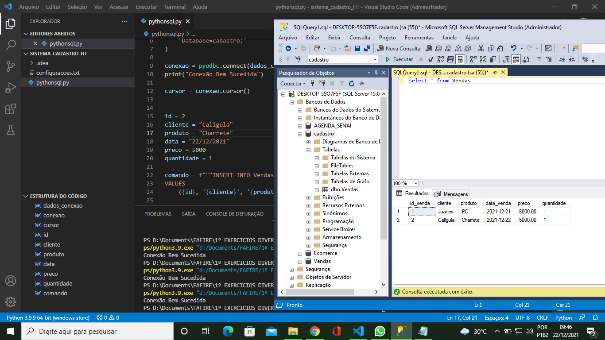

# 👨‍💻️ Integrar Python e SQL - Passo a Passo com Exemplo Prático

Tendo o banco de dados criado nós já podemos partir para a integração entre Python e SQL e vamos fazer isso com a biblioteca pyodbc.

**Passo 1:** Baixar e instalar o SSMS - digitar no google download ssms e baixar 1º link do resultado.
 
**Passo 2:** Instalar
 
**Passo 3:** Criar Banco de Dados, abrindo uma query e rodando:

CREATE DATABASE Nome_Banco_Dados

**Passo 4:** Criar tabela, usando:

USE Nome_Banco_Dados
CREATE TABLE Vendas(
    id_venda int,
    cliente varchar(50),
    produto varchar(50),
    data_venda date,
    preco decimal(6, 2),
    quantidade int,
    )

**Passo 5:** Adicionar 1 valor exemplo:

INSERT INTO Vendas(id_venda, cliente, produto, data_venda, preco, quantidade)
VALUES
    (1, 'Joanes', 'PC', '21/12/2021', 8000, 1)
